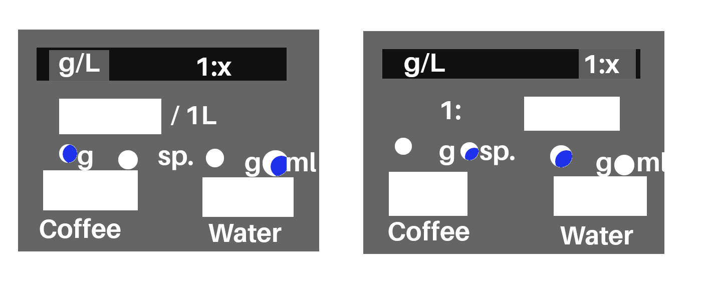

# Vaatimusmäärittely

## Sovelluksen tavoitteet

Sovelluksen tarkoitus eli pieni tekstuaalinen yleiskuvaus sovelluksesta

DoseCalculator-sovellusta on tarkoitus käyttää erikoiskahvien 
valmistamisessa. Käyttäen sovellusta, voidaan laskea tarvittava määrä 
jauhettua kahvia toivotulle kahvijuoman määrälle ja vahvuudelle, sekä 
toisin päin.

## Käyttöliittymäluonnos

Sovellus koostuu yhdestä ikkunasta, jossa on kaksi välilehteä.

## Suunniteltu toiminnallisuus

- Laskee kahvijauheen määrän annetulle vesimäärälle ja vahvuudelle
- Laskee veden määrän annetulle kahvijauheen määrälle ja vahvuudelle
- Laskee vahvuuden annetulle kahvijauheen ja veden määrän
- Kahvijauheen määrä voidaan antaa ja lukea grammoina tai 
"kahvimittoina" (7g)
- Veden määärä voidaan antaa ja lukea millilitroina tai grammoina
- Vahvuus voidaan antaa muodoissa 1:X ja g/L.
