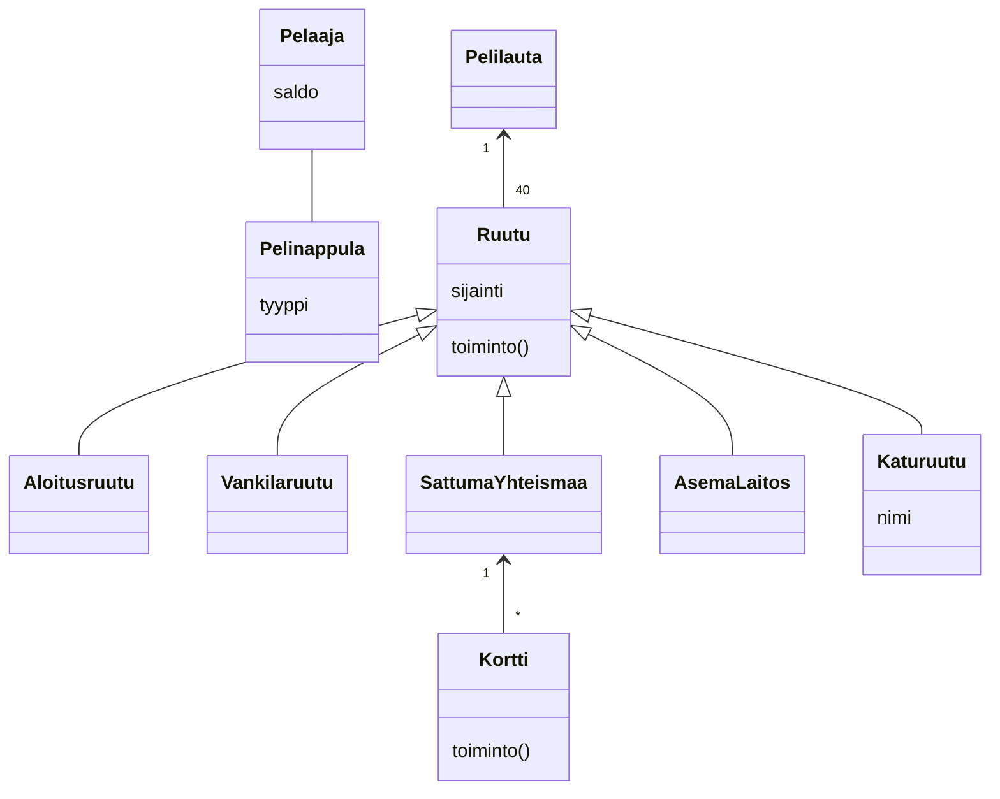

```mermaid
classDiagram
	Pelaaja -- Pelinappula
	class Pelaaja{
		saldo
	}
	class Pelinappula{
		tyyppi
	}
	Pelilauta "1" <-- "40" Ruutu
	class Ruutu{
		sijainti
		toiminto()
	}
	Ruutu <|-- Aloitusruutu
	Ruutu <|-- Vankilaruutu
	Ruutu <|-- SattumaYhteismaa
	SattumaYhteismaa "1" <-- "*" Kortti
	class Kortti{
		toiminto()
	}
	Ruutu <|-- AsemaLaitos
	Ruutu <|-- Katuruutu
	class Katuruutu{
		nimi
	}
```
